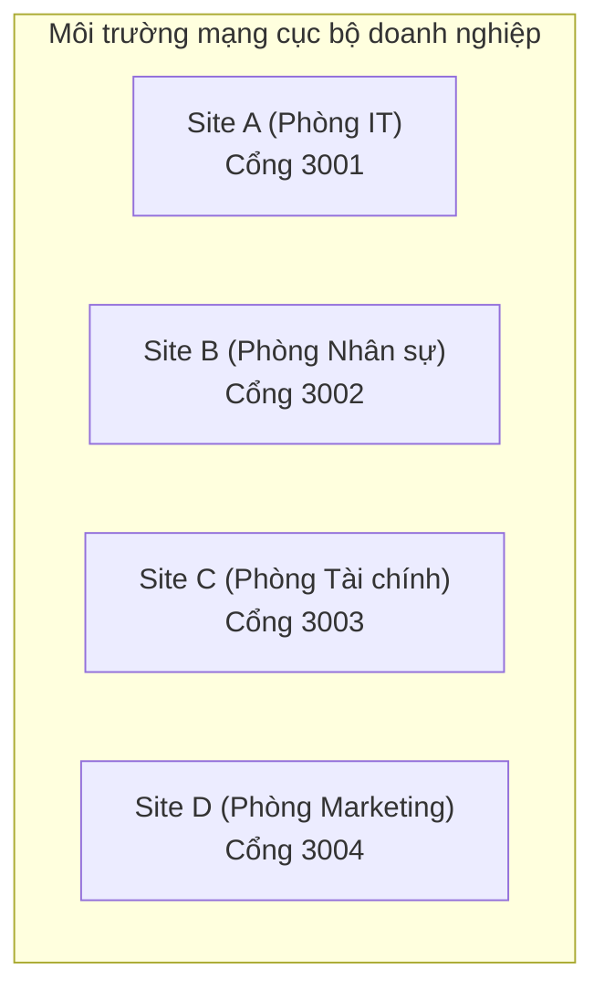
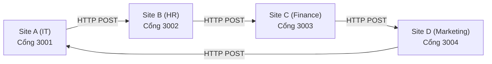
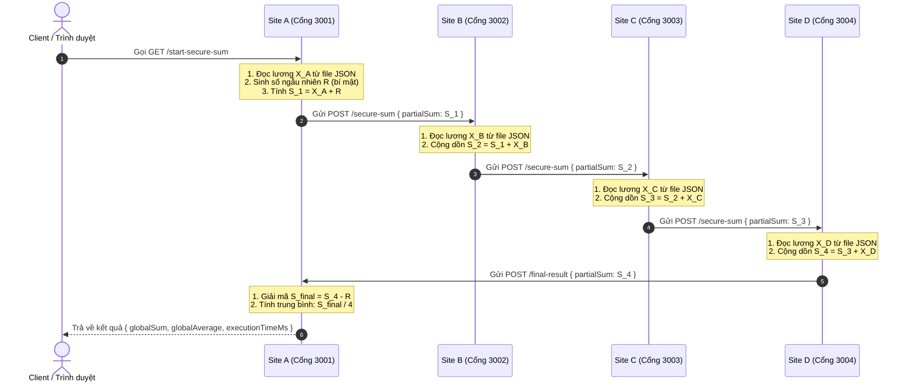

TÀI LIỆU THIẾT KẾ KIẾN TRÚC HỆ THỐNG (DESIGN DOCUMENT)
ĐỀ TÀI: KHẢO SÁT LƯƠNG BẢO MẬT SỬ DỤNG SMPC VỚI GIAO THỨC SECURE SUM
MÃ ĐỀ TÀI: 104

Tài liệu này đặc tả chi tiết kiến trúc phân tán, luồng giao tiếp mạng vòng, thiết kế lưu trữ cục bộ và cơ chế chịu lỗi của hệ thống mô phỏng tính toán tổng lương đa bên bảo toàn quyền riêng tư.

---

1. SƠ ĐỒ KIẾN TRÚC HỆ THỐNG (SYSTEM ARCHITECTURE DIAGRAM)

Hệ thống được thiết kế theo kiến trúc phi tập trung, không chia sẻ bộ nhớ (Shared-Nothing Architecture) giữa các phòng ban. Mỗi phòng ban (Site) hoạt động độc lập trên một tiến trình Node.js máy chủ Web Express riêng biệt lắng nghe trên một cổng TCP cục bộ.

  - Tính tự trị dữ liệu (Data Autonomy): Mỗi Site chịu trách nhiệm quản lý hệ lưu trữ JSON riêng của mình. Không Site nào được phép truy cập trực tiếp vào hệ thống tệp tin hoặc cơ sở dữ liệu của Site khác.
  - Tầng mạng giao tiếp: Giao tiếp giữa các nút mạng được thực hiện thông qua giao thức HTTP/REST API sử dụng thư viện Axios truyền tải payloads định dạng JSON.

---

2. LUỒNG TRUYỀN TIN TUẦN HOÀN MẠNG VÒNG (COMMUNICATION FLOW)

Giao thức sử dụng cấu trúc mạng vòng (Ring Topology) khép kín để truyền tải giá trị tổng tích lũy bán phần. Gói tin chỉ di chuyển theo chiều một hướng cố định:

  - Định tuyến vòng khép kín:
    + Site A gửi dữ liệu sang Site B.
    + Site B gửi dữ liệu sang Site C.
    + Site C gửi dữ liệu sang Site D.
    * Site D gửi trả dữ liệu về Site A để kết thúc chu trình và thực hiện giải mã tổng toàn cục.
  - Chế độ nghe lén (Hacker Mode): Khi được kích hoạt, dữ liệu đi từ Site A sẽ chuyển hướng qua cổng 3005 của Hacker Proxy, sau đó Hacker Proxy chuyển tiếp nguyên vẹn sang Site B để hoàn tất luồng truyền tin.

---

3. LƯỢC ĐỒ TUẦN TỰ GIAO THỨC SECURE SUM (SEQUENCE DIAGRAM)

Dưới đây là sơ đồ mô tả tuần tự các bước tính toán và bảo vệ quyền riêng tư thông qua số ngẫu nhiên R sinh ra tại Site A:

---

4. THIẾT KẾ LƯU TRỮ CỤC BỘ (STORAGE DESIGN)

Hệ thống lưu trữ vật lý của 4 site được phân rã độc lập hoàn toàn trong thư mục của từng tiến trình để bảo đảm tính tự trị dữ liệu cao nhất của hệ cơ sở dữ liệu phân tán:
  - Site A: site-a/data/salary.json
  - Site B: site-b/data/salary.json
  - Site C: site-c/data/salary.json
  - Site D: site-d/data/salary.json

Cấu trúc định dạng dữ liệu (Schema) của tệp tin salary.json:
{
  "department": "Tên phòng ban",
  "salary_total": Mức lương
}

Ví dụ cụ thể về dữ liệu thực tế lưu trữ tại các Site:
  - Site A: { "department": "IT", "salary_total": 120000 }
  - Site B: { "department": "HR", "salary_total": 150000 }
  - Site C: { "department": "Finance", "salary_total": 180000 }
  - Site D: { "department": "Marketing", "salary_total": 130000 }

---

5. CƠ CHẾ CHỊU LỖI VÀ KHẢ NĂNG PHỤC HỒI (FAILURE HANDLING)

Hệ thống phân tán được trang bị giao thức chịu lỗi tự động (Fault Tolerance) để ngăn ngừa hiện tượng treo luồng mạng vĩnh viễn (Infinite Blocking) khi có một nút mạng gặp sự cố sập nguồn hoặc mất kết nối:

a) Phát hiện lỗi bằng giới hạn thời gian (Timeout-based Detection):
  - Mọi yêu cầu HTTP POST gửi dữ liệu giữa các Site kế tiếp nhau được cấu hình thời gian chờ nghiêm ngặt là timeout: 3000ms.
  - Nếu site kế tiếp không phản hồi sau 3 giây hoặc cổng kết nối bị đóng đột ngột, Axios sẽ kích hoạt sự kiện lỗi mạng phân tán (ECONNREFUSED hoặc ETIMEDOUT).

b) Lan truyền lỗi phân tán tự động (Distributed Error Propagation):
  - Khi một nút mạng (ví dụ Site B) phát hiện nút mạng kế tiếp (Site C) bị sập, nó sẽ lập tức dừng gửi tin và trả về phản hồi lỗi HTTP 502 (Bad Gateway) kèm thông tin định danh nút lỗi cụ thể:
    {
      "success": false,
      "failedNode": "Site C (Port 3003)",
      "message": "Kết nối đến Site C thất bại hoặc hết thời gian chờ. Nút mạng có thể đã bị sập."
    }
  - Thông báo lỗi này sẽ được truyền ngược tuần tự qua chuỗi cuộc gọi HTTP về lại Site khởi tạo (Site A). Site A sẽ bóc tách phản hồi và kết xuất thông tin lỗi rõ ràng ra giao diện Client, giải phóng bộ nhớ của các site khác trong chu kỳ.
