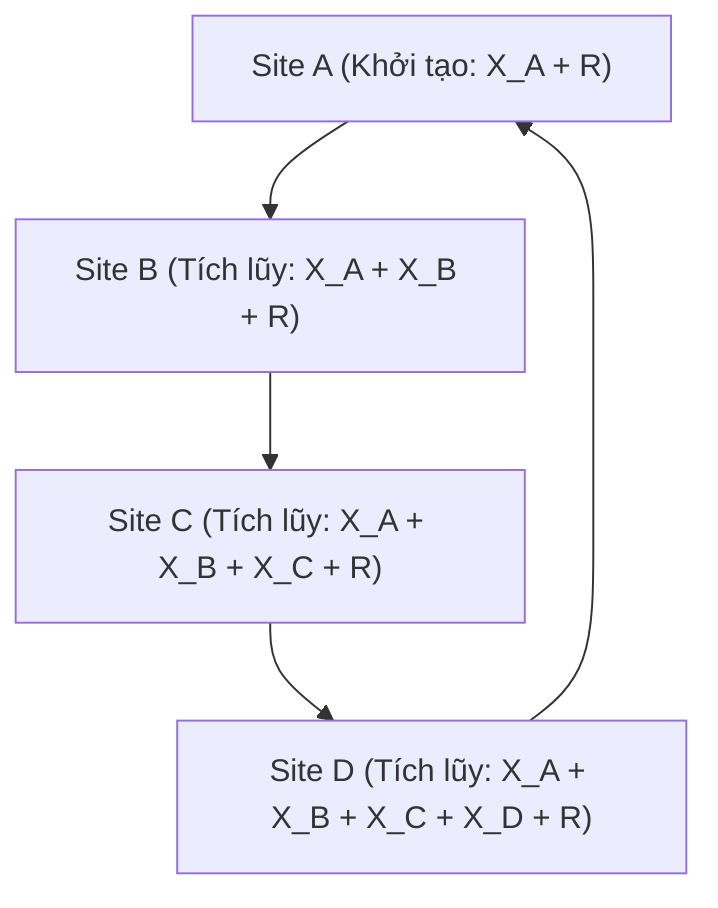

# BẢN ĐỀ XUẤT DỰ ÁN HỆ CƠ SỞ DỮ LIỆU PHÂN TÁN
## ĐỀ TÀI: KHẢO SÁT LƯƠNG BẢO MẬT SỬ DỤNG SMPC VỚI GIAO THỨC SECURE SUM

---

1. THÔNG TIN ĐỊNH DANH DỰ ÁN (PROJECT IDENTITY)

1.1. Tên nhóm: SecurRing (Kiến trúc mạng vòng bảo mật).

1.2. Thành viên thực hiện:
- Sinh viên: Võ Gia Huy
- Mã số sinh viên: N23DCCN163
- Lớp: D23CQCN03-N
- Email: n23dccn163@student.ptithcm.edu.vn
- Đơn vị: Khoa Công nghệ Thông tin, Học viện Công nghệ Bưu chính Viễn thông (PTIT), Cơ sở TP. Hồ Chí Minh.

1.3. Tên đề tài dự án:
- Tiếng Anh: A Privacy-Preserving Secure Sum Protocol for Distributed Multi-Party Salary Surveys in Enterprise Database Systems
- Tiếng Việt: Giao thức cộng lương bảo mật cho khảo sát lương đa bên bảo vệ quyền riêng tư trong hệ cơ sở dữ liệu phân tán doanh nghiệp

---

2. MỤC TIÊU VÀ PHÁT BIỂU BÀI TOÁN (OBJECTIVE & PROBLEM STATEMENT)

2.1. Thách thức và Sự cần thiết dưới góc nhìn Hệ Cơ sở dữ liệu Phân tán
Theo lý thuyết Hệ quản trị Cơ sở dữ liệu phân tán của M. Tamer Özsu và Patrick Valduriez, các tổ chức doanh nghiệp hiện đại thường lưu trữ dữ liệu phân rã tại nhiều vị trí vật lý độc lập (sites) để tối ưu hóa hiệu năng truy xuất cục bộ và đảm bảo tính tự trị dữ liệu.

Khi cần thực hiện các truy vấn gom cụm toàn cục (Global Aggregation) như tính Tổng (SUM) hoặc Trung bình (AVG) trên các dữ liệu nhạy cảm (ví dụ: khảo sát tổng lương của các phòng ban):

- Cách tiếp cận tập trung truyền thống (Centralized Coordination): Yêu cầu một nút trung tâm thu thập dữ liệu thô từ tất cả các site thành viên. Điều này tạo ra điểm yếu chí mạng (Single Point of Failure). Nếu máy chủ trung tâm bị tấn công hoặc đường truyền bị nghe lén, toàn bộ thông tin lương nhạy cảm của doanh nghiệp sẽ bị lộ.
- Thách thức về quyền riêng tư và lòng tin: Trong thực tế, các phòng ban có tính tự trị cao và không sẵn lòng chia sẻ số liệu tài chính chi tiết của mình cho các đơn vị khác. Mỗi site đòi hỏi quyền kiểm soát dữ liệu cục bộ và chỉ đồng ý công bố kết quả tổng hợp cuối cùng của toàn công ty mà không tiết lộ số liệu chi tiết của site mình.

Giải pháp: Hệ thống này ứng dụng mô hình Tính toán Đa bên An toàn (Secure Multi-party Computation) thông qua giao thức Secure Sum. Giao thức này cho phép các site tính toán tổng lương toàn cục một cách chính xác mà không yêu cầu bất kỳ site nào phải tiết lộ dữ liệu cục bộ của mình cho site khác hoặc cho máy chủ trung gian.

2.2. Quy trình hoạt động của Giao thức Secure Sum
Hệ thống giả lập một hệ phân tán gồm 4 site tương ứng với 4 phòng ban (Site A, Site B, Site C, Site D) hoạt động như các tiến trình mạng độc lập trên các cổng khác nhau của localhost. Mỗi site sở hữu một giá trị lương riêng tư là X (X_A, X_B, X_C, X_D) được lưu trữ trong tệp tin JSON cục bộ.

Giao thức Secure Sum chạy tuần hoàn theo mô hình mạng vòng (Ring Topology) Site A -> Site B -> Site C -> Site D -> Site A qua các bước sau:



- Bước 1: Giai đoạn Khởi tạo (Tại Site A): Site A sinh ngẫu nhiên một số thực lớn R (R > 0, với R lớn hơn nhiều so với X_A nhằm che giấu hoàn toàn dữ liệu gốc). Số R này được giữ bí mật hoàn toàn tại Site A. Site A tính tổng bán phần đầu tiên đã được che giấu: S_1 = X_A + R. Site A gửi S_1 sang Site B bằng một yêu cầu HTTP POST.
- Bước 2: Giai đoạn Tích lũy tuần hoàn (Tại các Site trung gian B, C, D):
  + Site B nhận S_1 từ Site A. Site B đọc lương cục bộ X_B từ tệp JSON của mình và tích lũy: S_2 = S_1 + X_B = X_A + X_B + R. Site B chuyển tiếp S_2 sang Site C qua HTTP POST.
  + Site C nhận S_2 từ Site B. Site C đọc lương cục bộ X_C và tích lũy: S_3 = S_2 + X_C = X_A + X_B + X_C + R. Site C chuyển tiếp S_3 sang Site D qua HTTP POST.
  + Site D nhận S_3 từ Site C. Site D đọc lương cục bộ X_D và tích lũy: S_4 = S_3 + X_D = X_A + X_B + X_C + X_D + R. Site D gửi ngược kết quả tích lũy cuối cùng S_4 về Site A qua HTTP POST.
- Bước 3: Giai đoạn Giải mã và Công bố kết quả (Tại Site A): Site A nhận được S_4 từ Site D. Site A giải mã bằng cách lấy kết quả nhận được trừ đi số ngẫu nhiên R đã lưu giữ ban đầu để thu được Tổng Lương Toàn Cục thực tế: S = S_4 - R. Từ đó, Site A tính toán Trung Bình Lương Toàn Cục: Global Average = S / 4.

2.3. Chứng minh Toán học về tính đúng đắn
Gọi X_i là dữ liệu riêng tư của Site i (i thuộc {A, B, C, D}) và R là số ngẫu nhiên được sinh ra tại Site A. Quy trình tích lũy tuần hoàn qua các nút mạng được biểu diễn như sau:

1. Tại Site A (khởi tạo):
   S_1 = X_A + R

2. Tại Site B:
   S_2 = S_1 + X_B

3. Tại Site C:
   S_3 = S_2 + X_C

4. Tại Site D:
   S_4 = S_3 + X_D

Thế tuần tự các giá trị:
   S_4 = (((X_A + R) + X_B) + X_C) + X_D

Áp dụng tính chất giao hoán và kết hợp của phép cộng trên tập số thực, ta có:
   S_4 = (X_A + X_B + X_C + X_D) + R

Tại đầu cuối của vòng tuần hoàn, Site A giải mã:
   S_final = S_4 - R
   S_final = ((X_A + X_B + X_C + X_D) + R) - R
   S_final = X_A + X_B + X_C + X_D

Do đó:
   S_final = Tổng các giá trị X_i với i thuộc {A, B, C, D}

Chứng minh này chỉ ra rằng thuật toán bảo toàn tuyệt đối tính toàn vẹn của phép tính tổng toàn cục trong khi số ngẫu nhiên R đóng vai trò che chở toàn bộ quá trình truyền tin trên mạng.

---

3. ĐẶC TẢ DỮ LIỆU (DATASET SPECIFICATION)

- Nguồn dữ liệu: Giả lập cục bộ trên từng nút mạng.
- Quy mô: 4 tệp tin JSON độc lập, mỗi tệp lưu trữ tại phân vùng cục bộ của từng Site.
- Cấu trúc tệp tin JSON:
  Mỗi phòng ban lưu trữ một tệp `salary.json` độc lập theo cấu trúc:
  ```json
  {
    "department": "string",
    "salary_total": "number"
  }
  ```
  Trong đó: `department` là tên phòng ban (IT, HR, Finance, Marketing) và `salary_total` là tổng lương của phòng ban (kiểu số nguyên dương).
- Dữ liệu khởi tạo tại các Site:
  + Site A (IT): `{"department": "IT", "salary_total": 120000}`
  + Site B (HR): `{"department": "HR", "salary_total": 150000}`
  + Site C (Finance): `{"department": "Finance", "salary_total": 180000}`
  + Site D (Marketing): `{"department": "Marketing", "salary_total": 130000}`
- Chiến lược phân rã dữ liệu: Sử dụng Phân rã ngang nguyên sơ (Primary Horizontal Fragmentation). Theo lý thuyết của Özsu, dữ liệu được phân mảnh dựa trên vị từ lựa chọn: department = Value_i với i thuộc {A, B, C, D}. Mỗi mảnh được đặt tại một site độc lập và chỉ site đó có quyền đọc/ghi cục bộ nhằm đảm bảo tính tự trị dữ liệu.

---

4. KIẾN TRÚC HỆ THỐNG (SYSTEM ARCHITECTURE)

- Các nút mạng giả lập: Hệ thống mô phỏng 4 nút mạng độc lập chạy trên localhost qua các tiến trình Node.js riêng biệt sử dụng các TCP port khác nhau: Site A (Port 3001), Site B (Port 3002), Site C (Port 3003), Site D (Port 3004).
- Tầng giao tiếp: Sử dụng giao thức HTTP/REST API phi đồng bộ. Cấu hình định tuyến tuần hoàn dạng vòng (Ring Topology): Site A (3001) -> Site B (3002) -> Site C (3003) -> Site D (3004) -> Site A (3001). Dữ liệu truyền tải giữa các Site được đóng gói dạng JSON: `{ "partialSum": number }`.
- Mô hình lưu trữ: Dữ liệu được lưu trữ vật lý trong cấu trúc thư mục tách biệt của mỗi tiến trình: `./site-[x]/data/salary.json`. Mỗi site chỉ có quyền truy xuất hệ thống tệp tin cục bộ thông qua mô-đun `fs`. Không tồn tại cơ sở dữ liệu chia sẻ chung (Shared-Nothing Architecture).

---

5. CÔNG NGHỆ VÀ KẾ HOẠCH TRIỂN KHAI (TECH STACK & IMPLEMENTATION PLAN)

- Ngôn ngữ và Môi trường: Node.js (CommonJS format).
- Cách thức triển khai: Chạy đa tiến trình cục bộ trên localhost thông qua kịch bản tự động hóa Node.js.
- Thư viện sử dụng: Express (xây dựng REST API Server), Axios (thực hiện các cuộc gọi HTTP POST phi đồng bộ) và CORS (cho phép chia sẻ tài nguyên giữa các cổng localhost khác nhau).
- Cấu trúc thư mục dự án:
  ```text
  Distributed-SMPC-Salary-Survey/
  ├── package.json
  ├── package-lock.json
  ├── start-all.js
  ├── site-a/
  │   ├── server.js
  │   └── data/
  │       └── salary.json
  ├── site-b/
  │   ├── server.js
  │   └── data/
  │       └── salary.json
  ├── site-c/
  │   ├── server.js
  │   └── data/
  │       └── salary.json
  ├── site-d/
  │   ├── server.js
  │   └── data/
  │       └── salary.json
  ├── hacker/
  │   └── hacker.js
  └── docs/
      ├── project_proposal.md
      └── walkthrough.md
  ```

---

6. CHỈ SỐ ĐO LƯỜNG VÀ PHÂN TÍCH (SUCCESS METRICS & ANALYSIS)

- Chỉ số Đo lường Định lượng:
  1. Tính chính xác của dữ liệu: Sai số giữa kết quả giải mã và tổng thực tế phải bằng 0.
  2. Thời gian xử lý vòng truyền tin (Latency): Thời gian thực thi toàn bộ vòng lặp đo bằng mili-giây từ lúc bắt đầu ở Site A đến khi Site A nhận được kết quả cuối cùng. Kỳ vọng thời gian xử lý đạt dưới 50ms trên môi trường localhost.
- Kịch bản mô phỏng kẻ tấn công (Hacker Mode):
  - Kịch bản: Giả sử một kẻ tấn công thực hiện nghe lén đường truyền HTTP POST giữa Site A và Site B và bắt được gói dữ liệu truyền đi.
  - Dữ liệu bắt được: Kẻ tấn công thu được thuộc tính `{ "partialSum": S1 }` (ví dụ: S_1 = X_A + R = 187707).
  - Phân tích tính an toàn: Hacker có phương trình S_1 = X_A + R. Do cả dữ liệu thật X_A và mặt nạ ngẫu nhiên R đều là các ẩn số đối với hacker, phương trình này có vô số bộ nghiệm thỏa mãn. Kẻ tấn công không thể xác định giá trị lương thực sự X_A từ gói tin bắt được. Quyền riêng tư của Site A được bảo toàn.
  - Triển khai thực tế: Lập trình tệp `hacker.js` đóng vai trò proxy cổng 3005 để bắt gói tin và hiển thị log minh họa quá trình phân tích bất khả thi của hacker.

---

7. TIẾN ĐỘ THỰC HIỆN DỰ ÁN (PROJECT MILESTONES)

- Giai đoạn 1 (Tuần 3 - 4): Thiết lập Môi trường và Phân rã dữ liệu
  + Hoàn thiện bản đề xuất dự án.
  + Khởi tạo cấu trúc thư mục, cài đặt Node.js và các thư viện cần thiết.
  + Tạo cấu trúc tệp dữ liệu giả lập `salary.json` tại thư mục dữ liệu cục bộ của 4 site.
- Giai đoạn 2 (Tuần 5 - 8): Lập trình Thuật toán Core và Định tuyến Vòng tròn
  + Viết mã nguồn cho các máy chủ Express tại Site A, B, C, D.
  + Cài đặt cơ chế sinh số ngẫu nhiên che giấu dữ liệu tại Site A và cơ chế tích lũy qua các site.
  + Cài đặt lời gọi API truyền tin tuần hoàn và giải mã cuối chu trình tại Site A.
- Giai đoạn 3 (Tuần 9 - 12): Giả lập Hacker Mode, Tối ưu hóa và Báo cáo
  + Thiết lập kịch bản Hacker Mode để mô phỏng việc bắt gói tin và phân tích bảo mật.
  + Đo lường thời gian thực thi của vòng truyền tin.
  + Xây dựng báo cáo phân tích chuyên sâu đối chiếu với các nguyên lý thiết kế CSDL phân tán của Özsu và chuẩn bị báo cáo hoàn chỉnh.
